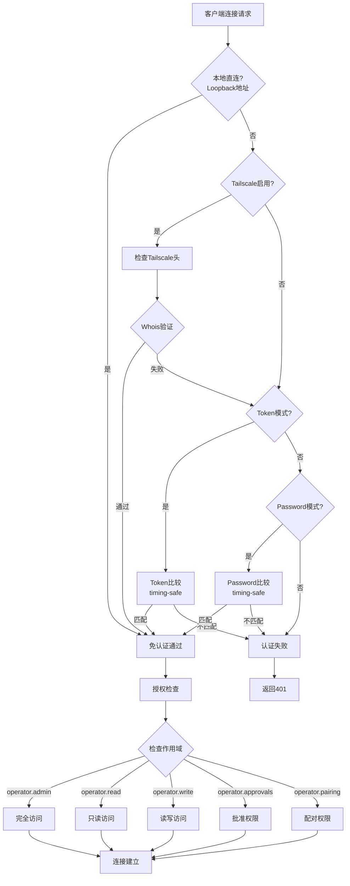
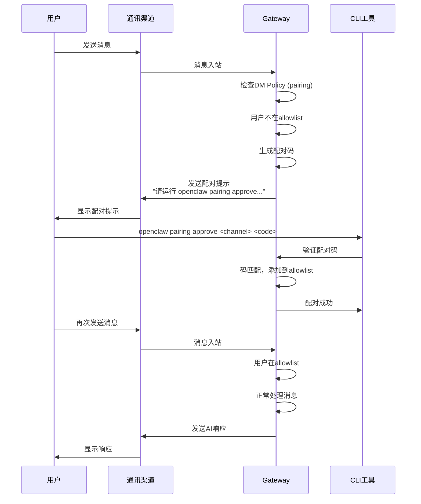
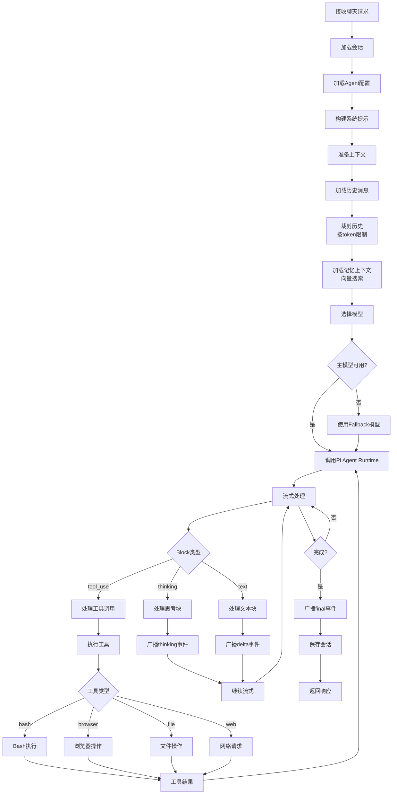
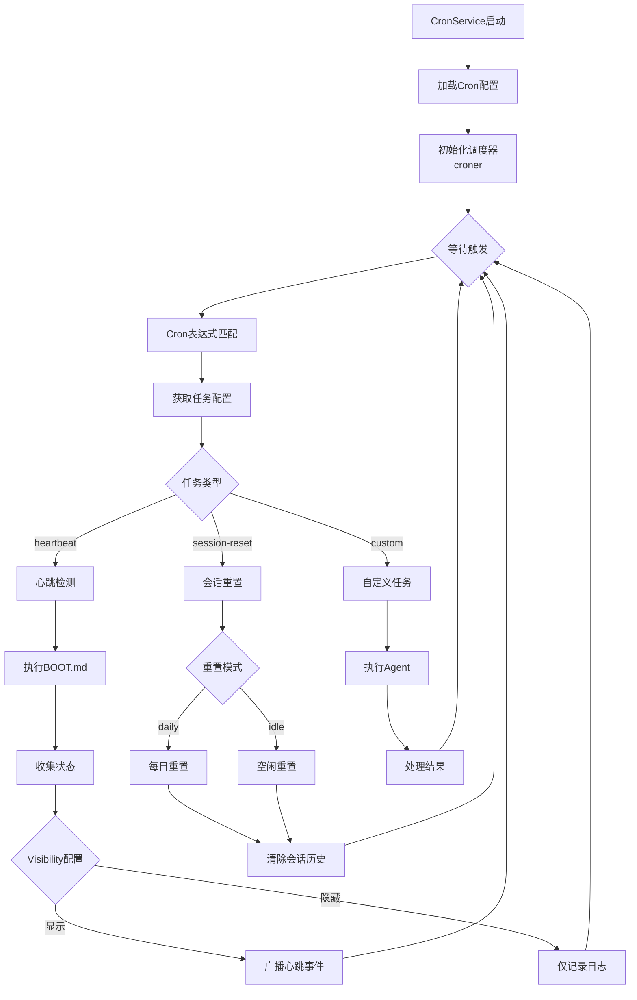

# OpenClaw 技术文档

> 版本: 2026.2.1 | 许可证: MIT | 最后更新: 2026-02-02

---

## 目录

1. [项目概述](#1-项目概述)
2. [技术栈](#2-技术栈)
3. [系统架构设计](#3-系统架构设计)
4. [核心模块详解](#4-核心模块详解)
5. [业务流程图](#5-业务流程图)
6. [数据模型](#6-数据模型)
7. [API设计](#7-api设计)
8. [安全机制](#8-安全机制)
9. [部署架构](#9-部署架构)
10. [开发指南](#10-开发指南)

---

## 1. 项目概述

### 1.1 项目定位

**OpenClaw** 是一个功能强大的个人AI助手平台，支持在用户自有设备上运行。它通过统一的网关服务连接多个通讯渠道（WhatsApp、Telegram、Slack、Discord、Signal、iMessage等30+平台），并利用先进的AI模型提供智能对话和任务处理能力。

### 1.2 核心特性

| 特性 | 描述 |
|------|------|
| **多渠道集成** | 支持30+通讯平台，包括WhatsApp、Telegram、Discord、Slack、Signal、iMessage等 |
| **多模型支持** | 集成Anthropic Claude、OpenAI GPT、Google Gemini、Qwen等主流AI模型 |
| **跨平台客户端** | 提供Web UI、CLI、macOS、iOS、Android原生应用 |
| **插件系统** | 可扩展的技能和工具系统，支持自定义插件开发 |
| **本地优先** | 数据存储在本地，保护用户隐私 |
| **灵活部署** | 支持Docker、Fly.io、Render等多种部署方式 |

### 1.3 项目结构

```
openclaw/
├── src/                    # 核心源代码 (~2000+ TypeScript文件)
│   ├── agents/            # AI代理引擎
│   ├── gateway/           # 网关服务器
│   ├── cli/               # 命令行工具
│   ├── channels/          # 通讯渠道
│   ├── plugins/           # 插件系统
│   ├── config/            # 配置管理
│   ├── security/          # 安全模块
│   ├── memory/            # 记忆系统
│   └── ...
├── apps/                   # 平台应用
│   ├── android/           # Android (Kotlin)
│   ├── ios/               # iOS (Swift)
│   ├── macos/             # macOS (Swift)
│   └── shared/            # 共享库
├── extensions/             # 30+渠道扩展插件
├── ui/                     # 控制面板 (Vite + Lit)
├── docs/                   # 文档网站
└── scripts/               # 构建脚本
```

---

## 2. 技术栈

### 2.1 后端技术

| 分类 | 技术 | 版本 | 用途 |
|------|------|------|------|
| **运行时** | Node.js | ≥22.12.0 | 服务器运行环境 |
| **语言** | TypeScript | 5.9.3 | 主要开发语言 |
| **包管理** | pnpm | 10.23.0 | 依赖管理 |
| **Web框架** | Express / Hono | 5.2.1 / 4.11.7 | HTTP服务器 |
| **WebSocket** | ws | 8.19.0 | 实时通信 |
| **验证** | Zod | 4.3.6 | 运行时数据验证 |
| **Schema** | TypeBox + AJV | - | JSON Schema验证 |

### 2.2 前端技术

| 分类 | 技术 | 版本 | 用途 |
|------|------|------|------|
| **框架** | Lit | 3.3.2 | Web Components |
| **构建** | Vite | 7.3.1 | 前端打包 |
| **打包** | Rolldown | 1.0.0-rc.2 | 生产构建 |
| **测试** | Vitest | 4.0.18 | 单元测试 |
| **Markdown** | marked | 17.0.1 | Markdown解析 |

### 2.3 移动端技术

| 平台 | 语言 | 工具链 |
|------|------|--------|
| **iOS** | Swift | XCode, XCodeGen, Fastlane |
| **macOS** | Swift | Swift Package Manager |
| **Android** | Kotlin | Gradle |

### 2.4 AI/ML集成

| 供应商 | 库/SDK | 用途 |
|--------|--------|------|
| **Anthropic** | @mariozechner/pi-* | Claude Pro/Max |
| **OpenAI** | openai | GPT系列模型 |
| **Google** | @google/generative-ai | Gemini |
| **AWS** | @aws-sdk/client-bedrock | Bedrock服务 |
| **本地** | ollama | 本地模型推理 |

### 2.5 通讯平台SDK

| 平台 | 库 | 版本 |
|------|-----|------|
| WhatsApp | @whiskeysockets/baileys | 7.0.0-rc.9 |
| Telegram | grammy | 1.39.3 |
| Slack | @slack/bolt | 4.6.0 |
| Discord | discord-api-types | 0.38.38 |
| LINE | @line/bot-sdk | 10.6.0 |
| Signal | signal-utils | 0.21.1 |

### 2.6 开发工具链

| 工具 | 用途 |
|------|------|
| **oxlint** | TypeScript类型感知代码检查 |
| **oxfmt** | 代码格式化 |
| **vitest** | 测试框架 |
| **playwright** | E2E浏览器测试 |
| **tsx** | TypeScript直接执行 |
| **swiftlint/swiftformat** | Swift代码质量 |

---

## 3. 系统架构设计

### 3.1 整体架构图

```
┌─────────────────────────────────────────────────────────────────────────┐
│                           客户端层 (Clients)                              │
├─────────────┬─────────────┬─────────────┬─────────────┬─────────────────┤
│   Web UI    │    CLI      │   macOS     │    iOS      │    Android      │
│  (Lit/Vite) │ (Commander) │  (Swift)    │  (Swift)    │   (Kotlin)      │
└──────┬──────┴──────┬──────┴──────┬──────┴──────┬──────┴────────┬────────┘
       │             │             │             │               │
       └─────────────┴─────────────┼─────────────┴───────────────┘
                                   │
                          ┌────────▼────────┐
                          │   Gateway层      │
                          │  WebSocket/HTTP  │
                          │   :18789/:18790  │
                          └────────┬────────┘
                                   │
       ┌───────────────────────────┼───────────────────────────┐
       │                           │                           │
┌──────▼──────┐           ┌────────▼────────┐          ┌───────▼───────┐
│  认证授权层   │           │    核心服务层     │          │   渠道集成层   │
│  Auth/Authz  │           │  Core Services  │          │   Channels    │
├─────────────┤           ├─────────────────┤          ├───────────────┤
│ Token Auth  │           │ Agent Engine    │          │ WhatsApp      │
│ Device Auth │           │ Session Mgmt    │          │ Telegram      │
│ Tailscale   │           │ Cron Service    │          │ Discord       │
│ DM Pairing  │           │ Memory/Embed    │          │ Slack         │
└─────────────┘           │ Plugin System   │          │ Signal        │
                          │ Routing Engine  │          │ iMessage      │
                          └────────┬────────┘          │ 30+ 更多...    │
                                   │                   └───────────────┘
                                   │
              ┌────────────────────┼────────────────────┐
              │                    │                    │
       ┌──────▼──────┐     ┌───────▼───────┐    ┌──────▼──────┐
       │  AI模型层    │     │   存储层       │    │   外部服务   │
       │   Models    │     │   Storage     │    │  External   │
       ├─────────────┤     ├───────────────┤    ├─────────────┤
       │ Anthropic   │     │ Sessions      │    │ Tailscale   │
       │ OpenAI      │     │ Config        │    │ Fly.io      │
       │ Gemini      │     │ Credentials   │    │ OAuth       │
       │ Ollama      │     │ Vector DB     │    │ Webhooks    │
       │ Bedrock     │     │ (sqlite-vec)  │    │ Pub/Sub     │
       └─────────────┘     └───────────────┘    └─────────────┘
```

### 3.2 Gateway 网关架构

```
                    ┌─────────────────────────────────────┐
                    │           Gateway Server            │
                    │         (server.ts 主入口)           │
                    └──────────────────┬──────────────────┘
                                       │
        ┌──────────────────────────────┼──────────────────────────────┐
        │                              │                              │
┌───────▼───────┐             ┌────────▼────────┐            ┌────────▼────────┐
│  HTTP Server  │             │ WebSocket Server│            │  Broadcaster    │
│ (server-http) │             │ (server-ws)     │            │ (server-broadcast)│
├───────────────┤             ├─────────────────┤            ├─────────────────┤
│ /hooks/*      │             │ 帧协议处理        │            │ 事件分发         │
│ /tools/*      │             │ 连接管理         │            │ 作用域过滤       │
│ /openai/*     │             │ 心跳检测         │            │ 缓冲管理         │
│ /slack/*      │             │ 认证握手         │            │ 状态版本         │
│ /control-ui/* │             └─────────────────┘            └─────────────────┘
└───────────────┘
        │
┌───────▼─────────────────────────────────────────────────────────────────────┐
│                          RPC Methods Handler                                 │
│                       (gateway/server-methods/)                              │
├─────────────┬─────────────┬─────────────┬─────────────┬─────────────────────┤
│ chat.*      │ agent.*     │ channels.*  │ config.*    │ cron.*              │
│ send        │ exec        │ status      │ get/set     │ jobs/run            │
│ history     │ agents.list │ login       │ apply       │ add/remove          │
│ abort       │ skills.*    │ logout      │ schema      │                     │
├─────────────┼─────────────┼─────────────┼─────────────┼─────────────────────┤
│ sessions.*  │ devices.*   │ nodes.*     │ logs.*      │ exec.approvals.*    │
│ list        │ pair.*      │ list        │ tail        │ request             │
│ patch       │ token.*     │             │             │ resolve             │
└─────────────┴─────────────┴─────────────┴─────────────┴─────────────────────┘
```

### 3.3 Agent 引擎架构

```
┌─────────────────────────────────────────────────────────────────┐
│                      Agent Engine (agents/)                      │
└──────────────────────────────┬──────────────────────────────────┘
                               │
        ┌──────────────────────┼──────────────────────┐
        │                      │                      │
┌───────▼───────┐      ┌───────▼───────┐     ┌───────▼───────┐
│  Model Layer  │      │ Prompt Layer  │     │  Tool Layer   │
├───────────────┤      ├───────────────┤     ├───────────────┤
│ model-*.ts    │      │ system-prompt │     │ bash-tools    │
│ 模型选择/切换   │      │ 提示词构建     │     │ browser-tools │
│ Fallback策略  │      │ 上下文管理     │     │ file-tools    │
│ 流式输出      │      │ 历史裁剪       │     │ web-tools     │
└───────────────┘      └───────────────┘     └───────────────┘
        │                      │                      │
        └──────────────────────┼──────────────────────┘
                               │
                    ┌──────────▼──────────┐
                    │   Pi Agent Runtime  │
                    │  (@mariozechner/pi) │
                    ├─────────────────────┤
                    │ • Block Streaming   │
                    │ • Tool Execution    │
                    │ • Thinking Mode     │
                    │ • Error Recovery    │
                    └─────────────────────┘
```

### 3.4 前端架构

```
┌─────────────────────────────────────────────────────────────────┐
│                    Control UI (ui/)                              │
│                    Lit + Vite + Web Components                   │
└──────────────────────────────┬──────────────────────────────────┘
                               │
┌──────────────────────────────┼──────────────────────────────────┐
│                          App Shell                               │
│                         (app.ts)                                 │
├──────────────────────────────┼──────────────────────────────────┤
│  ┌─────────┐   ┌─────────┐   │   ┌─────────┐   ┌─────────┐     │
│  │ Topbar  │   │  Nav    │   │   │ Content │   │ Sidebar │     │
│  │         │   │         │   │   │         │   │ (Tool)  │     │
│  └─────────┘   └─────────┘   │   └─────────┘   └─────────┘     │
└──────────────────────────────┼──────────────────────────────────┘
                               │
    ┌──────────────────────────┼──────────────────────────────┐
    │                     Views Layer                          │
    ├────────┬────────┬────────┬────────┬────────┬────────────┤
    │  Chat  │Overview│Channels│Sessions│  Cron  │  Config    │
    │        │        │        │        │        │            │
    ├────────┼────────┼────────┼────────┼────────┼────────────┤
    │ Skills │ Nodes  │ Debug  │  Logs  │Instances│           │
    └────────┴────────┴────────┴────────┴────────┴────────────┘
                               │
    ┌──────────────────────────┼──────────────────────────────┐
    │                  Controllers Layer                       │
    │         (API调用封装, 状态管理, 事件处理)                   │
    └──────────────────────────┼──────────────────────────────┘
                               │
    ┌──────────────────────────▼──────────────────────────────┐
    │              Gateway Browser Client                      │
    │                   (gateway.ts)                           │
    │    WebSocket连接 | 设备认证 | 请求/响应 | 事件订阅          │
    └─────────────────────────────────────────────────────────┘
```

---

## 4. 核心模块详解

### 4.1 Gateway 网关模块

**位置**: `src/gateway/`

**职责**:
- 提供WebSocket和HTTP服务
- 管理客户端连接和认证
- 处理RPC方法调用
- 广播事件到订阅客户端
- 协调渠道和Agent通信

**核心文件**:
```
gateway/
├── server.ts              # 主服务器入口
├── server-http.ts         # HTTP请求处理
├── server-ws.ts           # WebSocket连接管理
├── server-broadcast.ts    # 事件广播系统
├── server-chat.ts         # 聊天运行注册表
├── server-channels.ts     # 渠道生命周期
├── auth.ts                # 认证逻辑
├── client.ts              # 客户端抽象
└── protocol/              # 协议定义
    └── schema/            # JSON Schema
```

### 4.2 Agent 代理模块

**位置**: `src/agents/`

**职责**:
- AI模型调用和管理
- 系统提示词构建
- 工具注册和执行
- 技能加载和管理
- 上下文和历史管理

**核心组件**:
| 组件 | 文件 | 功能 |
|------|------|------|
| 模型管理 | model-*.ts | 模型选择、切换、Fallback |
| 提示词 | system-prompt.ts | 系统提示构建 |
| Bash工具 | bash-tools.*.ts | 命令执行工具 |
| CLI运行器 | cli-runner/ | CLI命令执行 |
| Pi集成 | pi-embedded-*.ts | Pi Agent运行时集成 |
| 技能系统 | skills/ | 技能加载和管理 |

### 4.3 Session 会话模块

**位置**: `src/sessions/`, `src/config/sessions/`

**职责**:
- 会话状态持久化
- 对话历史管理
- 会话作用域隔离
- 重置策略执行

**会话键格式**:
```
{channel}:{chatType}:{peerId}

示例:
- whatsapp:dm:+8613800138000
- telegram:group:-1001234567890
- discord:channel:123456789
```

### 4.4 Channels 渠道模块

**位置**: `src/channels/`, `extensions/`

**职责**:
- 渠道连接和认证
- 消息收发适配
- 媒体处理
- 渠道特定功能

**扩展渠道列表**:
```
extensions/
├── whatsapp/       # WhatsApp (Baileys)
├── telegram/       # Telegram (grammY)
├── discord/        # Discord
├── slack/          # Slack (Bolt)
├── signal/         # Signal
├── imessage/       # iMessage (macOS)
├── line/           # LINE
├── matrix/         # Matrix
├── msteams/        # Microsoft Teams
├── googlechat/     # Google Chat
├── mattermost/     # Mattermost
├── twitch/         # Twitch
├── nostr/          # Nostr协议
└── ... (20+ 更多)
```

### 4.5 Plugin 插件模块

**位置**: `src/plugins/`

**职责**:
- 插件发现和加载
- 工具注册和策略
- 配置Schema注册
- HTTP路由扩展

**核心文件**:
```
plugins/
├── loader.ts       # 插件加载器
├── registry.ts     # 插件注册表
├── manifest.ts     # 插件清单
└── sdk/           # 插件开发SDK
```

### 4.6 Memory 记忆模块

**位置**: `src/memory/`

**职责**:
- 向量嵌入生成
- 向量数据库存储
- 语义搜索
- 上下文检索

**支持的嵌入供应商**:
- OpenAI (batch-openai.ts)
- Gemini (batch-gemini.ts)
- 本地模型 (node-llama-cpp)

**向量存储**: sqlite-vec

---

## 5. 业务流程图

### 5.1 消息处理主流程

```mermaid
flowchart TB
    subgraph Input["消息入站"]
        A1[WhatsApp] --> B
        A2[Telegram] --> B
        A3[Discord] --> B
        A4[Slack] --> B
        A5[其他渠道] --> B
    end

    B[渠道适配器<br/>提取消息元数据]

    B --> C{消息类型}

    C -->|直聊 DM| D1[DM策略检查]
    C -->|群组| D2[群组策略检查]

    D1 --> E1{DM Policy}
    E1 -->|pairing| F1[检查配对码]
    E1 -->|allowlist| F2[检查允许列表]
    E1 -->|open| G

    F1 -->|通过| G
    F1 -->|未配对| F1A[发送配对提示]
    F2 -->|在列表| G
    F2 -->|不在列表| F2A[拒绝]

    D2 --> E2{Group Policy}
    E2 -->|mention-gating| F3{检查@提及}
    E2 -->|allowlist| F4[检查允许列表]
    E2 -->|disabled| F4A[忽略]

    F3 -->|有@| G
    F3 -->|无@| F3A[忽略]
    F4 -->|在列表| G
    F4 -->|不在列表| F4B[忽略]

    G[构造Session Key<br/>加载会话上下文]

    G --> H[路由解析<br/>选择Agent]

    H --> I[Agent执行]

    subgraph AgentExec["Agent处理"]
        I --> I1[构建系统提示]
        I1 --> I2[加载历史上下文]
        I2 --> I3[调用AI模型]
        I3 --> I4{需要工具?}
        I4 -->|是| I5[执行工具]
        I5 --> I3
        I4 -->|否| I6[生成响应]
    end

    I6 --> J[响应处理]

    J --> K[应用responsePrefix]
    K --> L[按chunkLimit分块]
    L --> M[格式化为渠道格式]

    M --> N[发送响应]

    subgraph Output["消息出站"]
        N --> O1[WhatsApp]
        N --> O2[Telegram]
        N --> O3[Discord]
        N --> O4[Slack]
        N --> O5[其他渠道]
    end

    N --> P[更新会话状态]
    P --> Q[完成]
```

### 5.2 Gateway 认证流程



### 5.3 设备配对流程



### 5.4 Agent 执行流程



### 5.5 前端数据流

```mermaid
flowchart LR
    subgraph UserAction["用户操作"]
        A1[点击导航]
        A2[发送消息]
        A3[修改配置]
    end

    subgraph StateUpdate["状态更新"]
        B1[setTab]
        B2[sendChatMessage]
        B3[updateConfigForm]
    end

    subgraph APICall["API调用"]
        C1[WebSocket Request]
        C2[等待响应]
    end

    subgraph StateSync["状态同步"]
        D1[@state属性更新]
        D2[触发render]
    end

    subgraph ViewUpdate["视图更新"]
        E1[Lit模板渲染]
        E2[DOM更新]
    end

    A1 --> B1
    A2 --> B2
    A3 --> B3

    B1 --> D1
    B2 --> C1
    B3 --> D1

    C1 --> C2
    C2 --> D1

    D1 --> D2
    D2 --> E1
    E1 --> E2
```

### 5.6 Cron 定时任务流程



---

## 6. 数据模型

### 6.1 核心实体模型

```typescript
// 会话实体
interface SessionEntry {
  sessionId: string;          // 唯一标识
  sessionKey: string;         // 格式: {channel}:{chatType}:{peerId}
  updatedAt: number;          // 最后更新时间戳
  sendPolicy?: "allow" | "deny";  // 发送策略
  lastHeartbeatText?: string;     // 上次心跳文本
  lastHeartbeatSentAt?: number;   // 上次心跳时间
}

// Agent配置
interface AgentConfig {
  id: string;                 // 代理ID
  model: ModelConfig;         // 主模型配置
  fallbackModels?: ModelConfig[];  // 备用模型
  identity: IdentityConfig;   // 身份配置
  workspace?: string;         // 工作区路径
  groupChat?: GroupChatConfig;    // 群聊配置
  tools?: ToolsConfig;        // 工具配置
}

// 渠道配置
interface ChannelConfig {
  type: ChannelType;          // 渠道类型
  enabled: boolean;           // 是否启用
  accounts?: AccountConfig[]; // 账户配置
  dmPolicy?: DMPolicy;        // DM策略
  groupPolicy?: GroupPolicy;  // 群组策略
  allowlist?: string[];       // 允许列表
}

// 消息模型
interface Message {
  role: "user" | "assistant" | "system";
  content: ContentBlock[];    // 内容块数组
  timestamp: number;
  metadata?: MessageMetadata;
}

// 内容块
type ContentBlock =
  | { type: "text"; text: string }
  | { type: "image"; source: ImageSource }
  | { type: "tool_use"; id: string; name: string; input: unknown }
  | { type: "tool_result"; tool_use_id: string; content: unknown };
```

### 6.2 配置Schema结构

```typescript
// 主配置
interface OpenClawConfig {
  agents: {
    default: string;          // 默认代理ID
    list: AgentConfig[];      // 代理列表
  };
  channels: {
    [channelType: string]: ChannelConfig;
  };
  session: {
    scope: "per-sender" | "global";
    resetMode: "daily" | "idle" | "manual";
    idleTimeout?: number;
  };
  messages: {
    historyLimit: number;
    chunkLimit: number;
    responsePrefix?: string;
  };
  gateway: {
    host: string;
    port: number;
    auth: AuthConfig;
  };
  tools: {
    policies: ToolPolicy[];
    disabled?: string[];
  };
  models: {
    providers: ProviderConfig[];
  };
}
```

### 6.3 协议帧格式

```typescript
// 请求帧
interface RequestFrame {
  type: "req";
  id: string;           // 请求ID (UUID)
  method: string;       // RPC方法名
  params?: unknown;     // 参数
}

// 响应帧
interface ResponseFrame {
  type: "res";
  id: string;           // 对应请求ID
  ok: boolean;          // 是否成功
  payload?: unknown;    // 成功时的数据
  error?: {             // 失败时的错误
    code: number;
    message: string;
    details?: unknown;
  };
}

// 事件帧
interface EventFrame {
  type: "event";
  event: string;        // 事件类型
  payload?: unknown;    // 事件数据
  seq?: number;         // 序列号
  stateVersion?: {
    presence: number;
    health: number;
  };
}
```

---

## 7. API设计

### 7.1 RPC方法列表

#### Chat 聊天相关

| 方法 | 参数 | 描述 |
|------|------|------|
| `chat.send` | sessionKey, message, runId | 发送聊天消息 |
| `chat.history` | sessionKey, limit | 获取聊天历史 |
| `chat.abort` | runId/sessionKey | 中止运行中的聊天 |
| `chat.inject` | sessionKey, message | 注入assistant消息 |

#### Agent 代理相关

| 方法 | 参数 | 描述 |
|------|------|------|
| `agent` | agentId, input | 执行代理 |
| `agents.list` | - | 获取代理列表 |
| `skills.status` | - | 获取技能状态 |
| `skills.enable` | skillId | 启用技能 |
| `skills.disable` | skillId | 禁用技能 |

#### Channel 渠道相关

| 方法 | 参数 | 描述 |
|------|------|------|
| `channels.status` | - | 获取渠道状态 |
| `channels.login` | channel, account | 登录渠道 |
| `channels.logout` | channel, account | 登出渠道 |
| `channels.config` | channel, config | 配置渠道 |

#### Config 配置相关

| 方法 | 参数 | 描述 |
|------|------|------|
| `config.get` | - | 获取当前配置 |
| `config.set` | config | 保存配置 |
| `config.apply` | - | 应用配置(重启网关) |
| `config.schema` | - | 获取配置Schema |

#### Session 会话相关

| 方法 | 参数 | 描述 |
|------|------|------|
| `sessions.list` | filter | 列出会话 |
| `sessions.patch` | sessionKey, patch | 更新会话 |
| `sessions.delete` | sessionKey | 删除会话 |

#### Device 设备相关

| 方法 | 参数 | 描述 |
|------|------|------|
| `devices.list` | - | 列出设备 |
| `device.pair.request` | deviceId | 请求配对 |
| `device.pair.approve` | deviceId | 批准配对 |
| `device.pair.reject` | deviceId | 拒绝配对 |
| `device.token.issue` | deviceId | 签发令牌 |

#### 其他

| 方法 | 参数 | 描述 |
|------|------|------|
| `send` | target, message | 发送消息 |
| `cron.jobs` | - | 列出定时任务 |
| `cron.run` | jobId | 运行任务 |
| `logs.tail` | level, limit | 获取日志 |
| `health` | - | 健康检查 |

### 7.2 事件类型

| 事件 | 负载 | 描述 |
|------|------|------|
| `chat` | {state, delta, runId} | 聊天状态更新 |
| `agent` | {type, payload} | Agent事件 |
| `presence` | {presence} | 在线状态变化 |
| `cron` | {jobId, status} | 定时任务事件 |
| `device.pair.requested` | {deviceId, info} | 配对请求 |
| `device.pair.resolved` | {deviceId, approved} | 配对结果 |
| `exec.approval.requested` | {id, tool, input} | 执行批准请求 |
| `exec.approval.resolved` | {id, approved} | 执行批准结果 |

---

## 8. 安全机制

### 8.1 认证层

| 机制 | 描述 |
|------|------|
| **Token认证** | 静态令牌，timing-safe比较 |
| **密码认证** | 密码验证，timing-safe比较 |
| **设备认证** | Ed25519签名，公钥验证 |
| **Tailscale集成** | Whois验证，用户身份映射 |
| **本地免认证** | Loopback地址自动通过 |

### 8.2 授权层

| 作用域 | 权限 |
|--------|------|
| `operator.admin` | 完全管理权限 |
| `operator.read` | 只读访问 |
| `operator.write` | 读写访问 |
| `operator.approvals` | 执行批准权限 |
| `operator.pairing` | 设备配对权限 |

### 8.3 安全防护

| 防护 | 实现 |
|------|------|
| **SSRF防护** | IPv4/v6私有地址检测，受限主机名 |
| **注入防护** | 外部内容标记和包装 |
| **时序攻击防护** | 使用crypto.timingSafeEqual |
| **DM访问控制** | 配对码机制，allowlist |

---

## 9. 部署架构

### 9.1 部署选项

| 方式 | 配置文件 | 适用场景 |
|------|----------|----------|
| **Docker** | Dockerfile, docker-compose.yml | 容器化部署 |
| **Fly.io** | fly.toml | 云原生部署 |
| **Render** | render.yaml | 简单云部署 |
| **Systemd** | 内置daemon | Linux服务 |
| **Launchd** | 内置daemon | macOS服务 |

### 9.2 Docker Compose 架构

```yaml
services:
  openclaw-gateway:
    image: openclaw:latest
    ports:
      - "18789:18789"    # WebSocket
      - "18790:18790"    # HTTP
    volumes:
      - ./config:/config
      - ./data:/data
    environment:
      - OPENCLAW_GATEWAY_TOKEN=${TOKEN}

  openclaw-cli:
    image: openclaw:latest
    depends_on:
      - openclaw-gateway
    command: ["cli", "--gateway", "ws://openclaw-gateway:18789"]
```

### 9.3 网络拓扑

```
┌─────────────────────────────────────────────────────────────┐
│                        Internet                              │
└──────────────────────────┬──────────────────────────────────┘
                           │
                ┌──────────▼──────────┐
                │    Reverse Proxy    │
                │   (Nginx/Caddy)     │
                └──────────┬──────────┘
                           │
         ┌─────────────────┼─────────────────┐
         │                 │                 │
    ┌────▼────┐      ┌─────▼─────┐     ┌─────▼─────┐
    │ Gateway │      │ Control   │     │ Tailscale │
    │  :18789 │      │ UI :18790 │     │  (可选)   │
    └────┬────┘      └───────────┘     └───────────┘
         │
    ┌────▼────────────────────────────┐
    │           Internal              │
    ├─────────────┬───────────────────┤
    │  Channels   │   AI Providers    │
    │  WhatsApp   │   Anthropic       │
    │  Telegram   │   OpenAI          │
    │  Discord    │   Gemini          │
    │  ...        │   ...             │
    └─────────────┴───────────────────┘
```

---

## 10. 开发指南

### 10.1 环境搭建

```bash
# 克隆仓库
git clone https://github.com/example/openclaw.git
cd openclaw

# 安装依赖
pnpm install

# 构建项目
pnpm build

# 开发模式
pnpm dev
```

### 10.2 项目脚本

| 脚本 | 描述 |
|------|------|
| `pnpm build` | 编译TypeScript + 构建UI |
| `pnpm dev` | 开发模式 |
| `pnpm test` | 运行测试 |
| `pnpm test:e2e` | E2E测试 |
| `pnpm lint` | 代码检查 |
| `pnpm format` | 代码格式化 |
| `pnpm gateway:dev` | 开发网关 |

### 10.3 添加新渠道

1. 在 `extensions/` 创建新目录
2. 实现渠道适配器接口
3. 注册到插件系统
4. 添加配置Schema
5. 编写测试

### 10.4 添加新工具

1. 在 `src/agents/` 创建工具文件
2. 定义工具Schema
3. 实现工具执行逻辑
4. 注册到Agent引擎
5. 配置工具策略

### 10.5 代码规范

- **KISS**: 保持简单
- **YAGNI**: 不要过度设计
- **DRY**: 避免重复
- **SOLID**: 遵循面向对象原则

---

## 附录

### A. 环境变量

| 变量 | 描述 |
|------|------|
| `OPENCLAW_GATEWAY_TOKEN` | 网关认证令牌 |
| `OPENCLAW_GATEWAY_PASSWORD` | 网关认证密码 |
| `ANTHROPIC_API_KEY` | Anthropic API密钥 |
| `OPENAI_API_KEY` | OpenAI API密钥 |
| `GOOGLE_AI_API_KEY` | Google AI API密钥 |

### B. 配置文件位置

| 文件 | 路径 |
|------|------|
| 主配置 | `~/.openclaw/config.json` |
| 凭证 | `~/.openclaw/credentials/` |
| 会话 | `~/.openclaw/state/sessions/` |
| 日志 | `~/.openclaw/logs/` |

### C. 端口分配

| 端口 | 服务 |
|------|------|
| 18789 | Gateway WebSocket |
| 18790 | Gateway HTTP / Control UI |

---

*文档生成时间: 2026-02-02*
