# OpenClaw 架构设计与流程图

> 本文档包含系统架构设计图、业务流程图和程序流程图

---

## 目录

1. [系统架构图](#1-系统架构图)
2. [业务流程图](#2-业务流程图)
3. [程序流程图](#3-程序流程图)
4. [数据流图](#4-数据流图)
5. [状态机图](#5-状态机图)
6. [时序图](#6-时序图)

---

## 1. 系统架构图

### 1.1 整体系统架构

```
┌─────────────────────────────────────────────────────────────────────────────────────┐
│                                    用户层 (Users)                                    │
├─────────────────────────────────────────────────────────────────────────────────────┤
│                                                                                      │
│   ┌──────────┐  ┌──────────┐  ┌──────────┐  ┌──────────┐  ┌──────────┐             │
│   │ WhatsApp │  │ Telegram │  │ Discord  │  │  Slack   │  │  其他    │  <-- 通讯用户 │
│   │   用户   │  │   用户   │  │   用户   │  │   用户   │  │  渠道   │              │
│   └────┬─────┘  └────┬─────┘  └────┬─────┘  └────┬─────┘  └────┬─────┘             │
│        │             │             │             │             │                    │
│        └─────────────┴─────────────┼─────────────┴─────────────┘                    │
│                                    │                                                 │
└────────────────────────────────────┼─────────────────────────────────────────────────┘
                                     │
┌────────────────────────────────────┼─────────────────────────────────────────────────┐
│                              渠道集成层 (Channels)                                    │
├────────────────────────────────────┼─────────────────────────────────────────────────┤
│                                    │                                                 │
│   ┌──────────────┐  ┌──────────────┐  ┌──────────────┐  ┌──────────────┐            │
│   │   Baileys    │  │   grammY     │  │ discord.js   │  │  Slack Bolt  │            │
│   │  (WhatsApp)  │  │  (Telegram)  │  │  (Discord)   │  │   (Slack)    │            │
│   └──────┬───────┘  └──────┬───────┘  └──────┬───────┘  └──────┬───────┘            │
│          │                 │                 │                 │                    │
│          └─────────────────┴─────────────────┴─────────────────┘                    │
│                                    │                                                 │
│                         ┌──────────▼──────────┐                                     │
│                         │    渠道适配器层      │                                     │
│                         │  Channel Adapters   │                                     │
│                         └──────────┬──────────┘                                     │
│                                    │                                                 │
└────────────────────────────────────┼─────────────────────────────────────────────────┘
                                     │
┌────────────────────────────────────┼─────────────────────────────────────────────────┐
│                               网关层 (Gateway)                                        │
├────────────────────────────────────┼─────────────────────────────────────────────────┤
│                                    │                                                 │
│   ┌────────────────────────────────▼────────────────────────────────────┐           │
│   │                        Gateway Server                                │           │
│   │                      WebSocket :18789 | HTTP :18790                  │           │
│   └────────────────────────────────┬────────────────────────────────────┘           │
│                                    │                                                 │
│   ┌─────────────┬──────────────────┼──────────────────┬─────────────┐               │
│   │             │                  │                  │             │               │
│   ▼             ▼                  ▼                  ▼             ▼               │
│ ┌─────────┐ ┌─────────┐ ┌──────────────────┐ ┌─────────┐ ┌─────────────┐           │
│ │  Auth   │ │ Router  │ │  RPC Methods     │ │Broadcast│ │   Cron      │           │
│ │ Module  │ │ Module  │ │  Handler         │ │ Module  │ │  Service    │           │
│ └─────────┘ └─────────┘ └──────────────────┘ └─────────┘ └─────────────┘           │
│                                    │                                                 │
└────────────────────────────────────┼─────────────────────────────────────────────────┘
                                     │
┌────────────────────────────────────┼─────────────────────────────────────────────────┐
│                              核心服务层 (Core Services)                               │
├────────────────────────────────────┼─────────────────────────────────────────────────┤
│                                    │                                                 │
│   ┌───────────┬────────────────────┼────────────────────┬───────────┐               │
│   │           │                    │                    │           │               │
│   ▼           ▼                    ▼                    ▼           ▼               │
│ ┌─────────┐ ┌─────────┐ ┌──────────────────┐ ┌─────────┐ ┌─────────────┐           │
│ │ Session │ │ Config  │ │   Agent Engine   │ │ Plugin  │ │   Memory    │           │
│ │ Manager │ │ Manager │ │ (Pi AI Runtime)  │ │ System  │ │   System    │           │
│ └─────────┘ └─────────┘ └──────────────────┘ └─────────┘ └─────────────┘           │
│                                    │                                                 │
│                         ┌──────────▼──────────┐                                     │
│                         │     Tool System     │                                     │
│                         │  Bash|Browser|File  │                                     │
│                         └─────────────────────┘                                     │
│                                                                                      │
└─────────────────────────────────────────────────────────────────────────────────────┘
                                     │
┌────────────────────────────────────┼─────────────────────────────────────────────────┐
│                               AI模型层 (AI Models)                                    │
├────────────────────────────────────┼─────────────────────────────────────────────────┤
│                                    │                                                 │
│   ┌───────────┬────────────────────┼────────────────────┬───────────┐               │
│   │           │                    │                    │           │               │
│   ▼           ▼                    ▼                    ▼           ▼               │
│ ┌─────────┐ ┌─────────┐ ┌──────────────────┐ ┌─────────┐ ┌─────────────┐           │
│ │Anthropic│ │ OpenAI  │ │     Gemini       │ │  Qwen   │ │   Ollama    │           │
│ │ Claude  │ │   GPT   │ │                  │ │         │ │   (Local)   │           │
│ └─────────┘ └─────────┘ └──────────────────┘ └─────────┘ └─────────────┘           │
│                                                                                      │
└─────────────────────────────────────────────────────────────────────────────────────┘
                                     │
┌────────────────────────────────────┼─────────────────────────────────────────────────┐
│                               存储层 (Storage)                                        │
├────────────────────────────────────┼─────────────────────────────────────────────────┤
│                                    │                                                 │
│   ┌───────────┬────────────────────┼────────────────────┬───────────┐               │
│   │           │                    │                    │           │               │
│   ▼           ▼                    ▼                    ▼           ▼               │
│ ┌─────────┐ ┌─────────┐ ┌──────────────────┐ ┌─────────┐ ┌─────────────┐           │
│ │Sessions │ │ Config  │ │   Credentials    │ │ Logs    │ │ Vector DB   │           │
│ │ (JSONL) │ │ (JSON5) │ │    (Secure)      │ │         │ │ (sqlite-vec)│           │
│ └─────────┘ └─────────┘ └──────────────────┘ └─────────┘ └─────────────┘           │
│                                                                                      │
│   文件路径: ~/.openclaw/                                                             │
│   ├── config.json                                                                   │
│   ├── credentials/                                                                  │
│   ├── state/sessions/                                                               │
│   └── logs/                                                                         │
│                                                                                      │
└─────────────────────────────────────────────────────────────────────────────────────┘
                                     │
┌────────────────────────────────────┼─────────────────────────────────────────────────┐
│                              客户端层 (Clients)                                       │
├────────────────────────────────────┼─────────────────────────────────────────────────┤
│                                    │                                                 │
│   ┌───────────┬────────────────────┼────────────────────┬───────────┐               │
│   │           │                    │                    │           │               │
│   ▼           ▼                    ▼                    ▼           ▼               │
│ ┌─────────┐ ┌─────────┐ ┌──────────────────┐ ┌─────────┐ ┌─────────────┐           │
│ │ Web UI  │ │   CLI   │ │     macOS        │ │   iOS   │ │   Android   │           │
│ │(Lit/Vite)│ │(Commander)│ │   (Swift)        │ │ (Swift) │ │  (Kotlin)   │           │
│ └─────────┘ └─────────┘ └──────────────────┘ └─────────┘ └─────────────┘           │
│                                                                                      │
└─────────────────────────────────────────────────────────────────────────────────────┘
```

### 1.2 Gateway 详细架构

```
┌─────────────────────────────────────────────────────────────────────────────────┐
│                              Gateway Server                                      │
│                           (src/gateway/server.ts)                                │
└────────────────────────────────────┬────────────────────────────────────────────┘
                                     │
         ┌───────────────────────────┼───────────────────────────┐
         │                           │                           │
         ▼                           ▼                           ▼
┌─────────────────┐        ┌─────────────────┐        ┌─────────────────┐
│   HTTP Server   │        │ WebSocket Server│        │   Broadcaster   │
│ (server-http.ts)│        │  (server-ws.ts) │        │(server-broadcast)│
├─────────────────┤        ├─────────────────┤        ├─────────────────┤
│ Endpoints:      │        │ Protocol:       │        │ Features:       │
│ • /hooks/*      │        │ • JSON-RPC      │        │ • Event Filter  │
│ • /tools/*      │        │ • Frame-based   │        │ • Scope Guards  │
│ • /openai/*     │        │ • Bi-directional│        │ • Buffer Mgmt   │
│ • /slack/*      │        │                 │        │ • State Version │
│ • /control-ui/* │        │ Lifecycle:      │        │                 │
│ • /canvas/*     │        │ • Connect       │        │ Events:         │
│                 │        │ • Challenge     │        │ • chat          │
│ Middleware:     │        │ • Hello         │        │ • agent         │
│ • Auth          │        │ • Request/Resp  │        │ • presence      │
│ • CORS          │        │ • Events        │        │ • cron          │
│ • Rate Limit    │        │ • Heartbeat     │        │ • device.*      │
│                 │        │ • Disconnect    │        │ • exec.*        │
└────────┬────────┘        └────────┬────────┘        └────────┬────────┘
         │                          │                          │
         └──────────────────────────┼──────────────────────────┘
                                    │
                     ┌──────────────▼──────────────┐
                     │      RPC Methods Router     │
                     │   (gateway/server-methods/) │
                     └──────────────┬──────────────┘
                                    │
    ┌───────────────┬───────────────┼───────────────┬───────────────┐
    │               │               │               │               │
    ▼               ▼               ▼               ▼               ▼
┌─────────┐   ┌─────────┐   ┌─────────────┐  ┌─────────┐   ┌─────────────┐
│ chat.*  │   │ agent.* │   │ channels.*  │  │config.* │   │   cron.*    │
├─────────┤   ├─────────┤   ├─────────────┤  ├─────────┤   ├─────────────┤
│ send    │   │ exec    │   │ status      │  │ get     │   │ jobs        │
│ history │   │ list    │   │ login       │  │ set     │   │ run         │
│ abort   │   │ skills  │   │ logout      │  │ apply   │   │ add         │
│ inject  │   │         │   │ config      │  │ schema  │   │ remove      │
└─────────┘   └─────────┘   └─────────────┘  └─────────┘   └─────────────┘
    │               │               │               │               │
    ▼               ▼               ▼               ▼               ▼
┌─────────┐   ┌─────────┐   ┌─────────────┐  ┌─────────┐   ┌─────────────┐
│sessions │   │ nodes.* │   │ devices.*   │  │ logs.*  │   │exec.approvals│
├─────────┤   ├─────────┤   ├─────────────┤  ├─────────┤   ├─────────────┤
│ list    │   │ list    │   │ pair.*      │  │ tail    │   │ request     │
│ patch   │   │         │   │ token.*     │  │         │   │ resolve     │
│ delete  │   │         │   │ list        │  │         │   │ list        │
└─────────┘   └─────────┘   └─────────────┘  └─────────┘   └─────────────┘
```

### 1.3 Agent 引擎架构

```
┌─────────────────────────────────────────────────────────────────────────────────┐
│                            Agent Engine (src/agents/)                            │
└────────────────────────────────────┬────────────────────────────────────────────┘
                                     │
         ┌───────────────────────────┼───────────────────────────┐
         │                           │                           │
         ▼                           ▼                           ▼
┌─────────────────┐        ┌─────────────────┐        ┌─────────────────┐
│  Model Manager  │        │  Prompt Builder │        │  Tool Registry  │
│   (model-*.ts)  │        │(system-prompt.ts)│        │  (bash-tools)   │
├─────────────────┤        ├─────────────────┤        ├─────────────────┤
│ • Model Select  │        │ • System Prompt │        │ • Tool Schema   │
│ • Fallback      │        │ • User Prompt   │        │ • Tool Execute  │
│ • Streaming     │        │ • Context Merge │        │ • Policy Check  │
│ • Token Count   │        │ • History Trim  │        │ • Result Format │
└────────┬────────┘        └────────┬────────┘        └────────┬────────┘
         │                          │                          │
         └──────────────────────────┼──────────────────────────┘
                                    │
                     ┌──────────────▼──────────────┐
                     │      Pi Agent Runtime       │
                     │   (@mariozechner/pi-*)      │
                     ├─────────────────────────────┤
                     │ • Block Streaming           │
                     │ • Tool Call Orchestration   │
                     │ • Thinking Mode             │
                     │ • Error Recovery            │
                     │ • Abort Handling            │
                     └──────────────┬──────────────┘
                                    │
    ┌───────────────┬───────────────┼───────────────┬───────────────┐
    │               │               │               │               │
    ▼               ▼               ▼               ▼               ▼
┌─────────┐   ┌─────────┐   ┌─────────────┐  ┌─────────┐   ┌─────────────┐
│ Bash    │   │ Browser │   │    File     │  │   Web   │   │   Custom    │
│ Tools   │   │ Tools   │   │   Tools     │  │  Tools  │   │   Plugins   │
├─────────┤   ├─────────┤   ├─────────────┤  ├─────────┤   ├─────────────┤
│ • exec  │   │ • browse│   │ • read      │  │ • fetch │   │ • skill-*   │
│ • shell │   │ • click │   │ • write     │  │ • search│   │ • mcp-*     │
│ • script│   │ • type  │   │ • edit      │  │ • scrape│   │ • ext-*     │
└─────────┘   └─────────┘   └─────────────┘  └─────────┘   └─────────────┘

                                    │
                                    ▼
                     ┌──────────────────────────────┐
                     │        Skills System         │
                     │       (agents/skills/)       │
                     ├──────────────────────────────┤
                     │ • Skill Discovery            │
                     │ • Skill Loading              │
                     │ • API Key Injection          │
                     │ • Enable/Disable             │
                     └──────────────────────────────┘
```

### 1.4 前端架构

```
┌─────────────────────────────────────────────────────────────────────────────────┐
│                           Control UI (ui/src/)                                   │
│                          Lit + Vite + Web Components                             │
└────────────────────────────────────┬────────────────────────────────────────────┘
                                     │
┌────────────────────────────────────▼────────────────────────────────────────────┐
│                              App Shell (app.ts)                                  │
│                           @customElement("openclaw-app")                         │
├──────────────────────────────────────────────────────────────────────────────────┤
│                                                                                  │
│  ┌────────────────────────────────────────────────────────────────────────────┐ │
│  │                              Topbar                                         │ │
│  │  ┌──────────────┐  ┌────────────────────────────┐  ┌──────────────────┐   │ │
│  │  │    Logo      │  │      Connection Status     │  │  Theme Toggle    │   │ │
│  │  └──────────────┘  └────────────────────────────┘  └──────────────────┘   │ │
│  └────────────────────────────────────────────────────────────────────────────┘ │
│                                                                                  │
│  ┌──────────────────┐  ┌──────────────────────────────────────────────────────┐ │
│  │                  │  │                                                      │ │
│  │      Nav         │  │                      Content                         │ │
│  │                  │  │                                                      │ │
│  │  ┌────────────┐  │  │  ┌────────────────────────────────────────────────┐ │ │
│  │  │   Chat     │  │  │  │                                                │ │ │
│  │  ├────────────┤  │  │  │              Active View                       │ │ │
│  │  │  Control   │  │  │  │                                                │ │ │
│  │  │  • Overview│  │  │  │  (chat | overview | channels | sessions |     │ │ │
│  │  │  • Channels│  │  │  │   cron | skills | nodes | config | debug |    │ │ │
│  │  │  • Instance│  │  │  │   logs | instances)                           │ │ │
│  │  │  • Sessions│  │  │  │                                                │ │ │
│  │  │  • Cron    │  │  │  └────────────────────────────────────────────────┘ │ │
│  │  ├────────────┤  │  │                                                      │ │
│  │  │   Agent    │  │  │  ┌────────────────────────────────────────────────┐ │ │
│  │  │  • Skills  │  │  │  │              Sidebar (Chat Only)               │ │ │
│  │  │  • Nodes   │  │  │  │                                                │ │ │
│  │  ├────────────┤  │  │  │              Tool Output Panel                 │ │ │
│  │  │  Settings  │  │  │  │                                                │ │ │
│  │  │  • Config  │  │  │  └────────────────────────────────────────────────┘ │ │
│  │  │  • Debug   │  │  │                                                      │ │
│  │  │  • Logs    │  │  │                                                      │ │
│  │  └────────────┘  │  │                                                      │ │
│  │                  │  │                                                      │ │
│  └──────────────────┘  └──────────────────────────────────────────────────────┘ │
│                                                                                  │
└──────────────────────────────────────────────────────────────────────────────────┘
                                     │
         ┌───────────────────────────┼───────────────────────────┐
         │                           │                           │
         ▼                           ▼                           ▼
┌─────────────────┐        ┌─────────────────┐        ┌─────────────────┐
│  State Manager  │        │   Controllers   │        │ Gateway Client  │
│   (@state)      │        │  (controllers/) │        │  (gateway.ts)   │
├─────────────────┤        ├─────────────────┤        ├─────────────────┤
│ • connected     │        │ • chat.ts       │        │ • WebSocket     │
│ • tab           │        │ • config.ts     │        │ • Device Auth   │
│ • chatMessages  │        │ • channels.ts   │        │ • Request/Resp  │
│ • settings      │        │ • sessions.ts   │        │ • Event Stream  │
│ • ...200+ props │        │ • cron.ts       │        │ • Reconnect     │
└─────────────────┘        │ • ...           │        └─────────────────┘
                           └─────────────────┘
```

---

## 2. 业务流程图

### 2.1 消息处理完整流程

```mermaid
flowchart TB
    subgraph Input["📥 消息入站"]
        A1[WhatsApp消息] --> B
        A2[Telegram消息] --> B
        A3[Discord消息] --> B
        A4[Slack消息] --> B
        A5[其他渠道消息] --> B
    end

    B[渠道适配器<br/>提取元数据]
    B --> C{消息类型判断}

    C -->|私聊 DM| D1[DM流程]
    C -->|群组消息| D2[群组流程]
    C -->|频道消息| D3[频道流程]

    subgraph DMFlow["🔒 DM处理流程"]
        D1 --> E1{DM Policy?}
        E1 -->|pairing| F1[检查配对状态]
        E1 -->|allowlist| F2[检查允许列表]
        E1 -->|open| G1[直接处理]

        F1 -->|已配对| G1
        F1 -->|未配对| F1A[发送配对码]
        F1A --> F1B[等待用户确认]

        F2 -->|在列表| G1
        F2 -->|不在列表| F2A[拒绝消息]
    end

    subgraph GroupFlow["👥 群组处理流程"]
        D2 --> E2{Group Policy?}
        E2 -->|mention-gating| G2A{检查@提及}
        E2 -->|allowlist| G2B[检查发送者]
        E2 -->|open| G2C[直接处理]
        E2 -->|disabled| G2D[忽略消息]

        G2A -->|有@机器人| G2C
        G2A -->|无@| G2D

        G2B -->|在列表| G2C
        G2B -->|不在列表| G2D
    end

    G1 --> H
    G2C --> H

    H[构造Session Key<br/>channel:chatType:peerId]
    H --> I[加载会话状态]

    I --> J{会话存在?}
    J -->|是| K[加载历史上下文]
    J -->|否| K1[创建新会话]
    K1 --> K

    K --> L[路由解析<br/>选择Agent]

    L --> M[Agent执行引擎]

    subgraph AgentEngine["🤖 Agent处理"]
        M --> M1[构建系统提示]
        M1 --> M2[合并历史上下文]
        M2 --> M3[准备工具集]
        M3 --> M4[调用AI模型]

        M4 --> M5{响应类型}
        M5 -->|thinking| M6[处理思考块]
        M5 -->|text| M7[处理文本块]
        M5 -->|tool_use| M8[执行工具调用]

        M6 --> M9[广播事件]
        M7 --> M9
        M8 --> M8A[工具执行]
        M8A --> M8B[工具结果]
        M8B --> M4

        M9 --> M10{完成?}
        M10 -->|否| M4
        M10 -->|是| M11[最终响应]
    end

    M11 --> N[响应后处理]

    subgraph PostProcess["📤 响应处理"]
        N --> N1[应用responsePrefix]
        N1 --> N2{超过chunkLimit?}
        N2 -->|是| N3[分块处理]
        N2 -->|否| N4[直接发送]
        N3 --> N4
        N4 --> N5[格式化为渠道格式]
    end

    N5 --> O[发送响应]

    subgraph Output["✅ 消息出站"]
        O --> O1[WhatsApp]
        O --> O2[Telegram]
        O --> O3[Discord]
        O --> O4[Slack]
        O --> O5[其他渠道]
    end

    O --> P[更新会话状态]
    P --> Q[保存到存储]
    Q --> R((完成))
```

### 2.2 用户认证流程

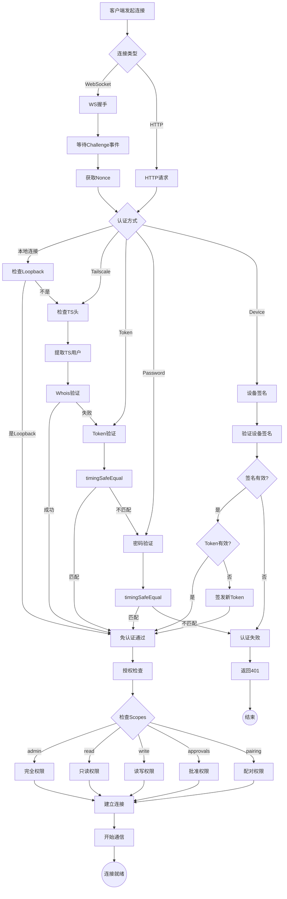

### 2.3 配置管理流程

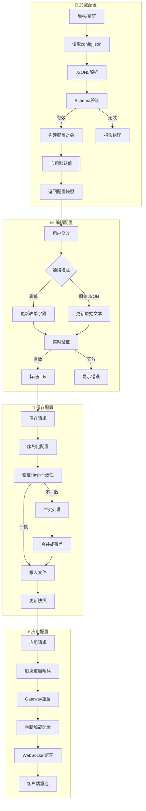

---

## 3. 程序流程图

### 3.1 Gateway 启动流程

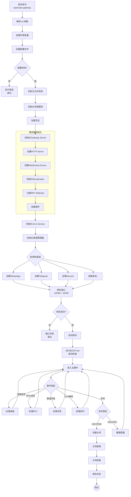

### 3.2 Agent 执行流程

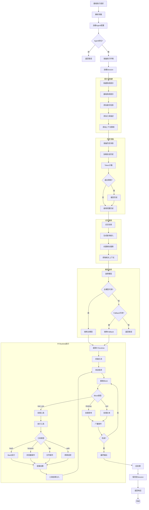

### 3.3 前端应用生命周期

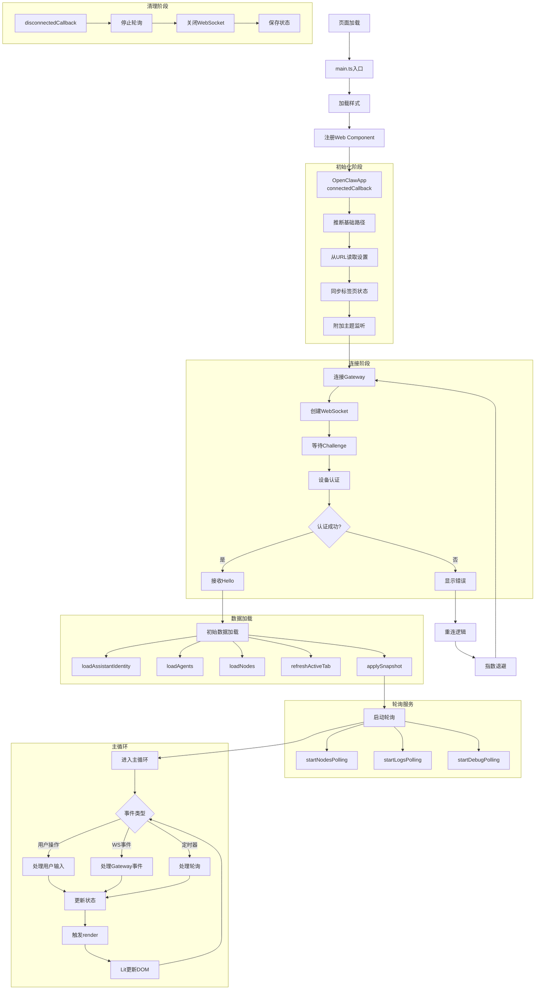

---

## 4. 数据流图

### 4.1 消息数据流

```
                              ┌──────────────────┐
                              │    用户消息      │
                              └────────┬─────────┘
                                       │
                                       ▼
┌──────────────────────────────────────────────────────────────────────────────┐
│                              渠道适配器层                                     │
│                                                                              │
│  ┌─────────┐  ┌─────────┐  ┌─────────┐  ┌─────────┐  ┌─────────┐           │
│  │WhatsApp │  │Telegram │  │ Discord │  │  Slack  │  │ Others  │           │
│  └────┬────┘  └────┬────┘  └────┬────┘  └────┬────┘  └────┬────┘           │
│       │            │            │            │            │                 │
│       └────────────┴────────────┼────────────┴────────────┘                 │
│                                 │                                           │
│                                 ▼                                           │
│                    ┌────────────────────────┐                               │
│                    │   消息标准化处理        │                               │
│                    │  • 提取发送者信息       │                               │
│                    │  • 提取消息内容        │                               │
│                    │  • 处理媒体附件        │                               │
│                    └───────────┬────────────┘                               │
└────────────────────────────────┼────────────────────────────────────────────┘
                                 │
                                 ▼
┌──────────────────────────────────────────────────────────────────────────────┐
│                              Gateway 处理层                                   │
│                                                                              │
│  ┌─────────────────────────────────────────────────────────────────────┐    │
│  │                        路由和会话处理                                 │    │
│  │                                                                     │    │
│  │   SessionKey: {channel}:{chatType}:{peerId}                        │    │
│  │                                                                     │    │
│  │   ┌─────────────┐     ┌─────────────┐     ┌─────────────┐         │    │
│  │   │ 路由解析    │ ──▶ │ 会话加载    │ ──▶ │ Agent选择   │         │    │
│  │   └─────────────┘     └─────────────┘     └─────────────┘         │    │
│  └─────────────────────────────────────────────────────────────────────┘    │
│                                 │                                           │
└─────────────────────────────────┼───────────────────────────────────────────┘
                                  │
                                  ▼
┌──────────────────────────────────────────────────────────────────────────────┐
│                              Agent 执行层                                     │
│                                                                              │
│   输入消息 ──▶ ┌─────────────────────────────────────────────────────┐      │
│               │                  提示词构建                          │      │
│               │  系统提示 + 历史上下文 + 记忆检索 + 当前消息          │      │
│               └───────────────────────┬─────────────────────────────┘      │
│                                       │                                     │
│                                       ▼                                     │
│               ┌─────────────────────────────────────────────────────┐      │
│               │                  AI模型调用                          │      │
│               │  Anthropic / OpenAI / Gemini / Ollama               │      │
│               └───────────────────────┬─────────────────────────────┘      │
│                                       │                                     │
│                          ┌────────────┼────────────┐                       │
│                          │            │            │                       │
│                          ▼            ▼            ▼                       │
│                   ┌──────────┐ ┌──────────┐ ┌──────────┐                  │
│                   │ Thinking │ │   Text   │ │ Tool Use │                  │
│                   └──────────┘ └──────────┘ └────┬─────┘                  │
│                                                   │                        │
│                                          ┌───────▼───────┐                │
│                                          │  工具执行     │                │
│                                          │ Bash/Browser  │                │
│                                          │ /File/Web     │                │
│                                          └───────┬───────┘                │
│                                                  │                         │
│                                                  ▼                         │
│                                          ┌──────────────┐                 │
│                                          │  工具结果    │                 │
│                                          └──────┬───────┘                 │
│                                                 │                          │
│                              ┌──────────────────┘                          │
│                              │                                             │
│                              ▼                                             │
│               ┌─────────────────────────────────────────────────────┐      │
│               │                  最终响应                            │      │
│               └───────────────────────┬─────────────────────────────┘      │
│                                       │                                     │
└───────────────────────────────────────┼─────────────────────────────────────┘
                                        │
                                        ▼
┌──────────────────────────────────────────────────────────────────────────────┐
│                              响应处理层                                       │
│                                                                              │
│   ┌─────────────┐     ┌─────────────┐     ┌─────────────┐                   │
│   │ 应用Prefix  │ ──▶ │ 分块处理    │ ──▶ │ 格式转换    │                   │
│   └─────────────┘     └─────────────┘     └─────────────┘                   │
│                                                 │                            │
└─────────────────────────────────────────────────┼────────────────────────────┘
                                                  │
                                                  ▼
┌──────────────────────────────────────────────────────────────────────────────┐
│                              渠道发送层                                       │
│                                                                              │
│       ┌────────────┬────────────┬────────────┬────────────┐                 │
│       │            │            │            │            │                 │
│       ▼            ▼            ▼            ▼            ▼                 │
│  ┌─────────┐  ┌─────────┐  ┌─────────┐  ┌─────────┐  ┌─────────┐           │
│  │WhatsApp │  │Telegram │  │ Discord │  │  Slack  │  │ Others  │           │
│  └─────────┘  └─────────┘  └─────────┘  └─────────┘  └─────────┘           │
│                                                                              │
└──────────────────────────────────────────────────────────────────────────────┘
                                        │
                                        ▼
                              ┌──────────────────┐
                              │    用户收到响应   │
                              └──────────────────┘
```

### 4.2 前端数据流

```
┌─────────────────────────────────────────────────────────────────────────────┐
│                              用户交互层                                      │
│                                                                             │
│   ┌──────────┐  ┌──────────┐  ┌──────────┐  ┌──────────┐                  │
│   │ 点击导航 │  │ 发送消息 │  │ 修改配置 │  │ 其他操作 │                  │
│   └────┬─────┘  └────┬─────┘  └────┬─────┘  └────┬─────┘                  │
│        │             │             │             │                         │
└────────┼─────────────┼─────────────┼─────────────┼─────────────────────────┘
         │             │             │             │
         ▼             ▼             ▼             ▼
┌─────────────────────────────────────────────────────────────────────────────┐
│                              事件处理层                                      │
│                                                                             │
│   ┌──────────────────────────────────────────────────────────────────┐     │
│   │                         Event Handlers                            │     │
│   │                                                                   │     │
│   │   setTab()  │  sendChatMessage()  │  updateConfig()  │  ...     │     │
│   └──────────────────────────────┬───────────────────────────────────┘     │
│                                  │                                          │
└──────────────────────────────────┼──────────────────────────────────────────┘
                                   │
         ┌─────────────────────────┼─────────────────────────┐
         │                         │                         │
         ▼                         ▼                         ▼
┌────────────────────┐  ┌────────────────────┐  ┌────────────────────┐
│   状态更新 (同步)   │  │  API调用 (异步)     │  │  本地存储 (持久)   │
│                    │  │                    │  │                    │
│  @state属性直接赋值  │  │  Controllers层调用  │  │  saveSettings()   │
│  this.tab = "chat" │  │  request("chat.send")│ │  localStorage     │
│                    │  │                    │  │                    │
└─────────┬──────────┘  └─────────┬──────────┘  └────────────────────┘
          │                       │
          │                       ▼
          │            ┌────────────────────┐
          │            │  Gateway WebSocket │
          │            │                    │
          │            │  • 发送请求帧      │
          │            │  • 等待响应帧      │
          │            │  • 接收事件帧      │
          │            └─────────┬──────────┘
          │                      │
          │                      ▼
          │            ┌────────────────────┐
          │            │    响应/事件处理    │
          │            │                    │
          │            │  handleGatewayEvent│
          │            │  handleResponse    │
          │            └─────────┬──────────┘
          │                      │
          ▼                      ▼
┌─────────────────────────────────────────────────────────────────────────────┐
│                              状态管理层                                      │
│                                                                             │
│   ┌──────────────────────────────────────────────────────────────────┐     │
│   │                      @state 属性集合                              │     │
│   │                                                                   │     │
│   │   connected: boolean        chatMessages: Message[]              │     │
│   │   tab: Tab                  settings: UiSettings                 │     │
│   │   chatSending: boolean      configForm: ConfigForm               │     │
│   │   ...200+ reactive props                                         │     │
│   └──────────────────────────────┬───────────────────────────────────┘     │
│                                  │                                          │
│                          状态变化触发                                        │
│                                  │                                          │
└──────────────────────────────────┼──────────────────────────────────────────┘
                                   │
                                   ▼
┌─────────────────────────────────────────────────────────────────────────────┐
│                              渲染层                                          │
│                                                                             │
│   ┌──────────────────────────────────────────────────────────────────┐     │
│   │                      Lit Render Cycle                             │     │
│   │                                                                   │     │
│   │   1. render() 被调用                                              │     │
│   │   2. 根据当前状态生成模板                                          │     │
│   │   3. Lit 对比虚拟DOM差异                                          │     │
│   │   4. 最小化DOM更新                                                 │     │
│   └──────────────────────────────┬───────────────────────────────────┘     │
│                                  │                                          │
└──────────────────────────────────┼──────────────────────────────────────────┘
                                   │
                                   ▼
┌─────────────────────────────────────────────────────────────────────────────┐
│                              视图层                                          │
│                                                                             │
│   ┌────────┐  ┌────────┐  ┌────────┐  ┌────────┐  ┌────────┐              │
│   │  Chat  │  │Overview│  │Channels│  │ Config │  │  Logs  │  ...         │
│   └────────┘  └────────┘  └────────┘  └────────┘  └────────┘              │
│                                                                             │
│                              DOM 更新                                        │
│                                                                             │
└─────────────────────────────────────────────────────────────────────────────┘
                                   │
                                   ▼
                         ┌──────────────────┐
                         │    用户看到更新   │
                         └──────────────────┘
```

---

## 5. 状态机图

### 5.1 WebSocket 连接状态机

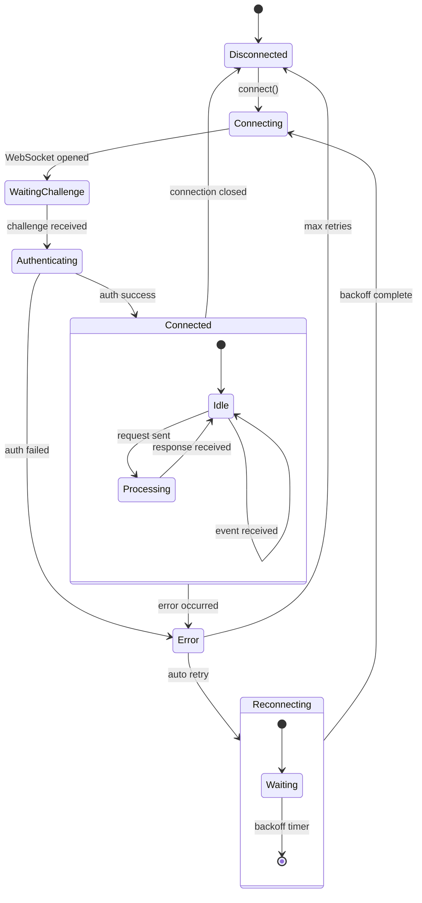

### 5.2 聊天状态机

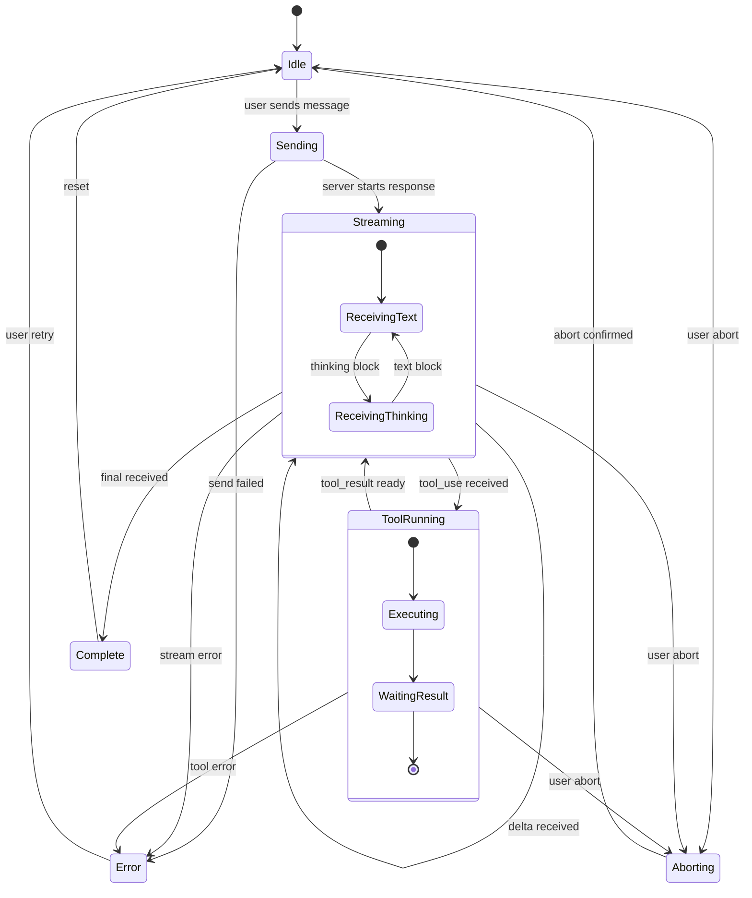

### 5.3 会话生命周期状态机

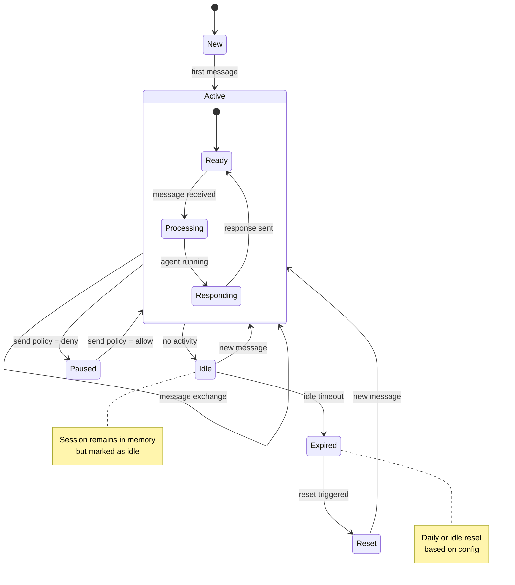

---

## 6. 时序图

### 6.1 完整消息处理时序

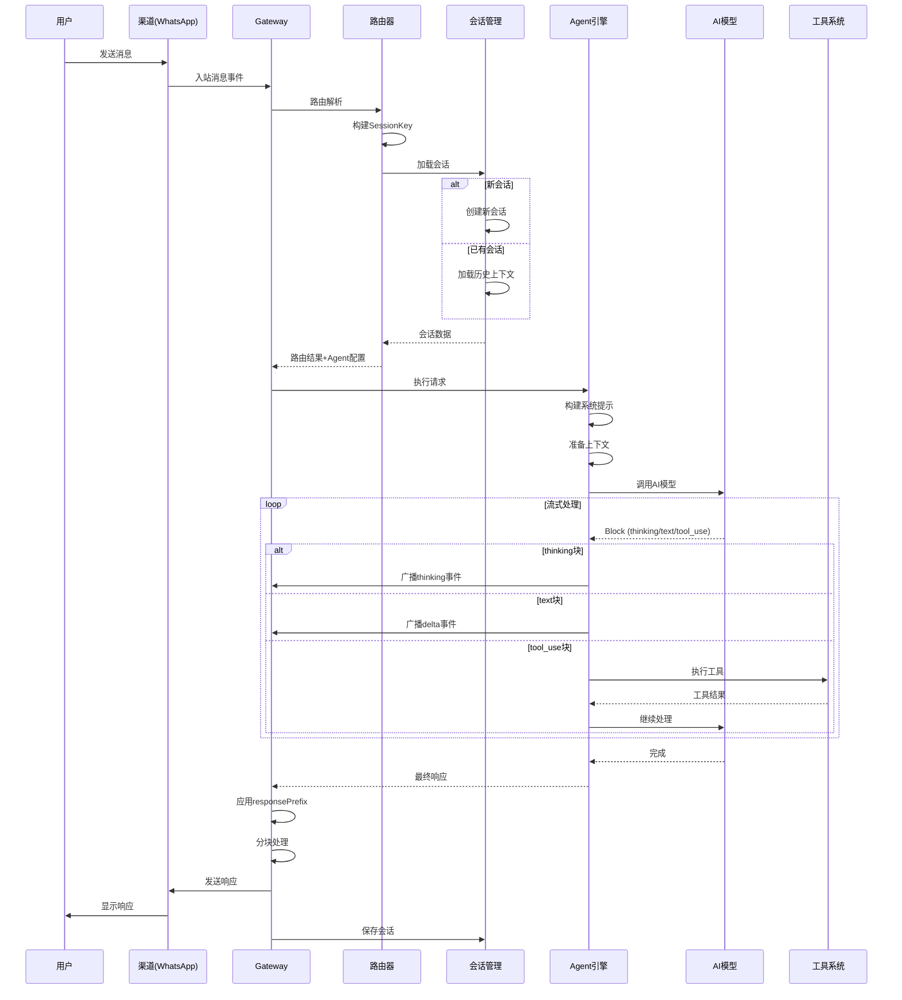

### 6.2 设备配对时序

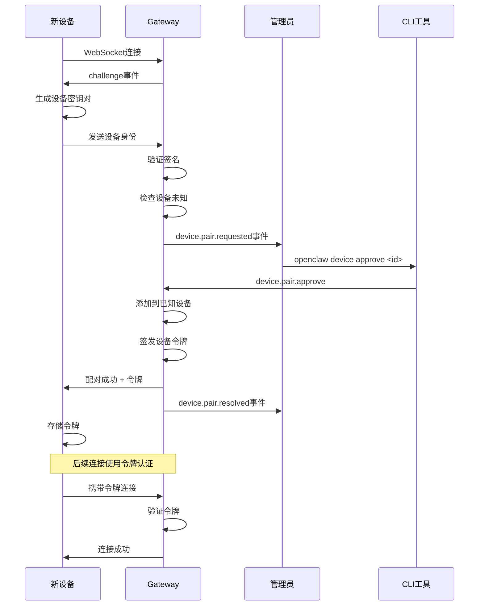

### 6.3 配置更新时序

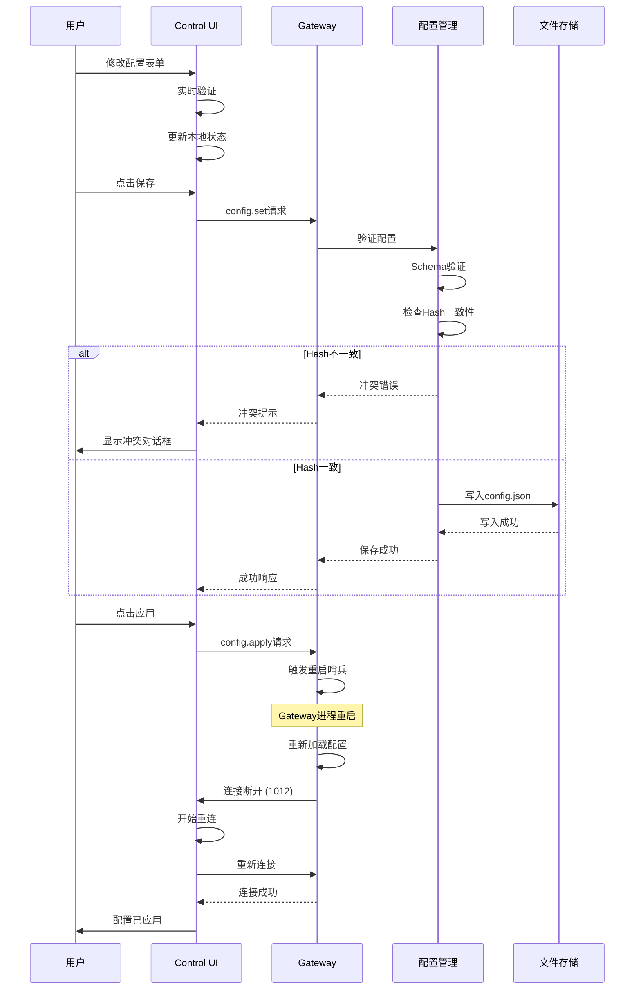

---

## 附录：图例说明

### 流程图符号

| 符号 | 含义 |
|------|------|
| ⬜ 矩形 | 处理步骤 |
| ◇ 菱形 | 判断/分支 |
| ⬭ 圆角矩形 | 开始/结束 |
| ▭ 平行四边形 | 输入/输出 |
| → 箭头 | 流程方向 |

### 架构图约定

| 层级 | 颜色/样式 | 说明 |
|------|----------|------|
| 用户层 | 顶部 | 用户和通讯渠道 |
| 网关层 | 中间 | Gateway服务 |
| 服务层 | 中间 | 核心业务服务 |
| 模型层 | 底部 | AI模型提供商 |
| 存储层 | 底部 | 数据持久化 |

---

*文档生成时间: 2026-02-02*
